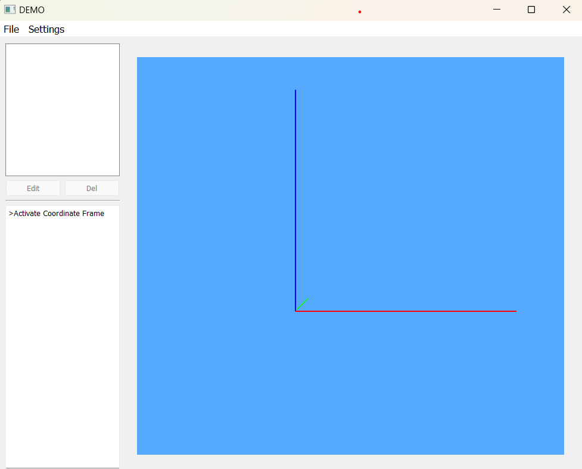
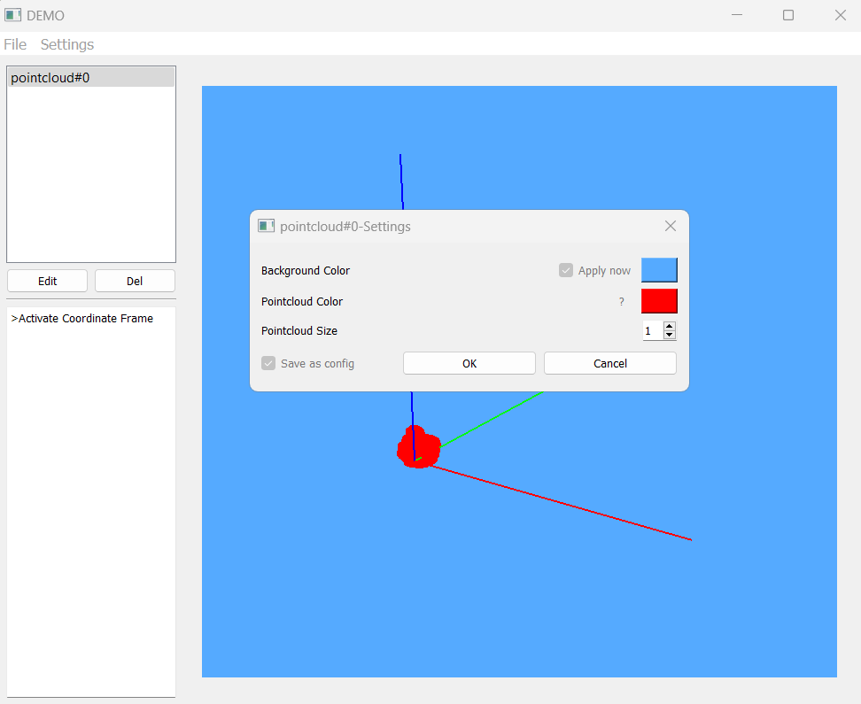

# osg_qtwidget

This is a point cloud visualization tool mainly provided by [maisvendoo](https://github.com/maisvendoo/OSG-lessons), if you found it is helpful, please do not hesitate to star his repository.

## Requirements

- OSG 3.6.4
- Qt 5.13
- VS 2017+

## Usage

The goal of this specific version is to build a point cloud visulization&processing software for my PhD project.

## Screenshot

